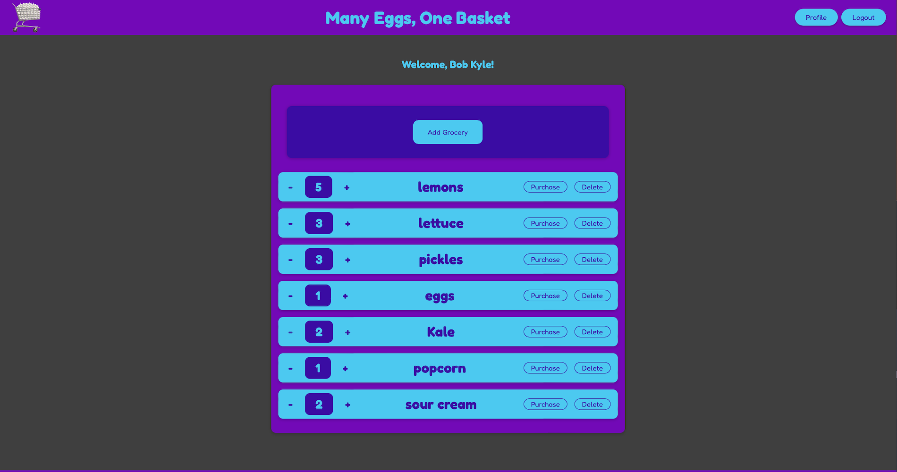

# Many Eggs, One Basket

## Table of Contents

- [Description](#description)
- [Available Scripts](#available-scripts)
- [Screenshot](#screenshot)
- [Link](#link)
- [Code](#code)
- [Contact](#contact)
- [Technologies](#technologies)
- [Project Status](#project-status)

## Description

A grocery list app built with React, Redux, and Firebase (Authentication and Realtime Database). The app requires users to sign up or log in to access and edit their stored list. Lists are stored in a cloud-based NoSQL database for access and retrieval from any device.

## Available Scripts

In the project directory, you can run:

### `npm start`

Runs the app in the development mode.\
Open [http://localhost:3000](http://localhost:3000) to view it in your browser.

The page will reload when you make changes.\
You may also see any lint errors in the console.

## Screenshot

## Link

[Many Eggs, One Basket Webpage](https://many-eggs-one-basket.web.app)

## Code

[GitHub Code Repository](https://github.com/Johny49/many-eggs-react)

## Contact

Created by [@johny49](https://github.com/Johny49/) - feel free to contact me!

## Technologies

- React
- Redux
- Firebase (Authentication and Realtime Database)
- JavaScript

## Project Status

Project is: completed and functioning with possible future improvements.
